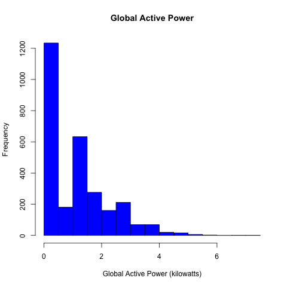
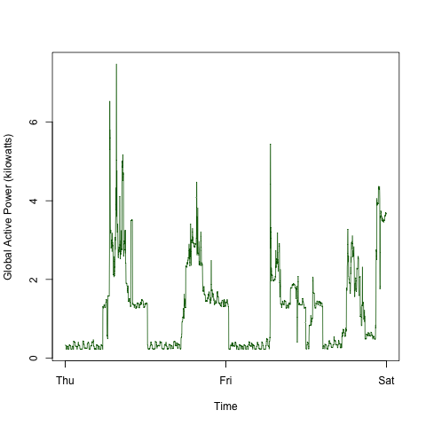
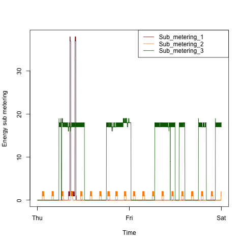
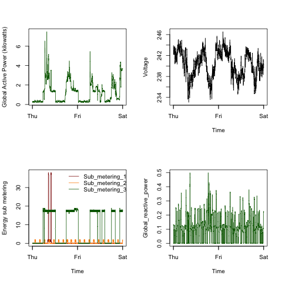

## Intructions:

Please download the datafile from:

* <b>Dataset</b>: <a href="https://d396qusza40orc.cloudfront.net/exdata%2Fdata%2Fhousehold_power_consumption.zip">Electric power consumption</a> [20Mb]

## Loading the data

Each .R file uses only data from 2-day period in February 2007. I used grep to select only the rows I am interested in.

## Making Plots

Each file (plot1.R to plot4.R) makes a single plot as asked by the assignment 

The four plots are shown below. 

### Plot 1

 

### Plot 2

 

### Plot 3

 

### Plot 4

 

